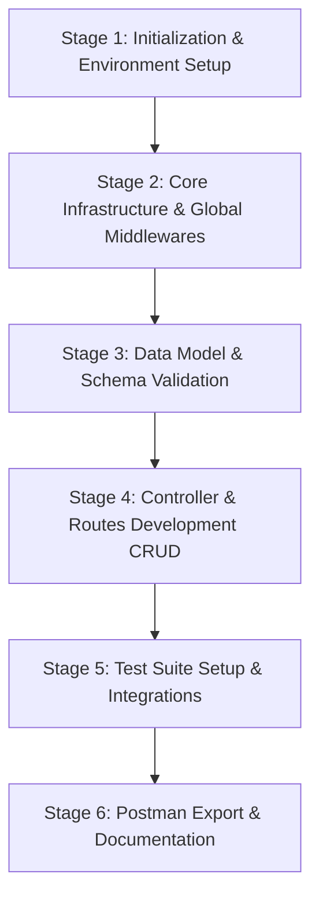

# Movie Recommendation API: Step-by-Step Implementation Guide

This guide provides a comprehensive, production-grade roadmap for building the Movie Recommendation API using **Node.js** and **Express.js**. It outlines the project structure, dependencies, individual file scripts, function/method signatures, API definitions, logical flow, and security verification steps.

---

## 1. Directory Structure

To support a clean, modular, and maintainable codebase, we will organize the project using a standard controller-route-service (or controller-route-data) pattern.

```text
group-7-movie-api/
├── .env.example
├── .env
├── .gitignore
├── .prettierrc
├── eslint.config.js
├── package.json
├── README.md
├── implementation_guide.md
├── src/
│   ├── app.js
│   ├── server.js
│   ├── config/
│   │   └── index.js
│   ├── data/
│   │   └── moviesData.js
│   ├── middleware/
│   │   ├── errorHandler.js
│   │   ├── logger.js
│   │   └── validator.js
│   ├── controllers/
│   │   └── moviesController.js
│   └── routes/
│       └── moviesRoutes.js
└── tests/
    └── movies.test.js
```

---

## 2. Dependencies and Scripts

### 2.1 Production Dependencies
- **`express`**: Fast, unopinionated, minimalist web framework for Node.js.
- **`dotenv`**: Zero-dependency module that loads environment variables from a `.env` file into `process.env`.
- **`cors`**: Express middleware to enable Cross-Origin Resource Sharing (CORS) with secure, configured origins.
- **`helmet`**: Secure Express apps by setting various HTTP response headers (XSS protection, Clickjacking protection, strict CSP, etc.).
- **`express-validator`**: A set of express.js middlewares that wraps validator.js to sanitize and validate input schema dynamically.

### 2.2 Development Dependencies
- **`jest`**: Delightful JavaScript Testing Framework with a focus on simplicity.
- **`supertest`**: Provides a high-level abstraction for testing HTTP endpoints without binding to a network port.
- **`eslint`**: Pluggable JavaScript linter to maintain clean code and identify patterns.
- **`prettier`**: Opinionated code formatter to enforce consistent code style.
- **`nodemon`**: Utility that monitors for any changes in the source and automatically restarts the server.

### 2.3 `package.json` Configuration
```json
{
  "name": "group-7-movie-api",
  "version": "1.0.0",
  "description": "A robust Express.js API designed to manage a movie collection, supporting full CRUD operations.",
  "main": "src/server.js",
  "type": "commonjs",
  "scripts": {
    "start": "node src/server.js",
    "dev": "nodemon src/server.js",
    "test": "jest --runInBand --detectOpenHandles",
    "lint": "eslint src/ tests/",
    "format": "prettier --write \"src/**/*.js\" \"tests/**/*.js\""
  }
}
```

---

## 3. Detailed File Specifications (The 12 Core Script Files)

Below is the logical definition of every script file, including functions, arguments, return values, and implementation steps.

### File 1: `.env.example` & `.env`
* **Path**: `/group-7-movie-api/.env.example`
* **Purpose**: Declares the required environment configuration variables for development and deployment.
* **Content**:
  ```ini
  PORT=3000
  NODE_ENV=development
  ```

---

### File 2: `src/config/index.js`
* **Path**: `/group-7-movie-api/src/config/index.js`
* **Purpose**: Central configuration manager. Loads environment variables, validates their existence, and exports them.
* **Logic/Variables**:
  - `PORT`: Parsed from `process.env.PORT` (defaults to `3000` if not set).
  - `NODE_ENV`: Parsed from `process.env.NODE_ENV` (defaults to `'development'`).
* **Exports**: An object containing `{ PORT, NODE_ENV }`.

---

### File 3: `src/data/moviesData.js`
* **Path**: `/group-7-movie-api/src/data/moviesData.js`
* **Purpose**: Simulates an in-memory database using a mutable JavaScript array. Handles basic CRUD lookup actions.
* **Initial Dataset State**:
  - Contains at least 3-5 pre-populated movie objects.
  - Structure of a Movie Object:
    ```javascript
    {
      id: 1,
      title: "Inception",
      genre: "Sci-Fi",
      releaseYear: 2010,
      rating: 8.8
    }
    ```
* **Functions & Methods**:
  1. `getAllMovies()`: Returns all movies in the array.
  2. `findMovieById(id)`: Returns the movie object whose `id` matches (converted to a number), or `undefined`.
  3. `findMovieByTitle(title)`: Returns a movie object matching the given title case-insensitively (used for preventing duplicate titles).
  4. `addMovie(movieData)`:
     - **Logic**: Find the maximum ID in the array, add `1` to get a new unique ID, construct a new movie object, append it to the array, and return the newly created movie object.
  5. `updateMovie(id, updateData)`:
     - **Logic**: Find the index of the movie by ID. Replace the entire contents (retaining the ID) with validated data, and return the updated movie.
  6. `updateMovieRating(id, rating)`:
     - **Logic**: Find the movie by ID. Update just its `rating` property. Return the updated movie.
  7. `deleteMovie(id)`:
     - **Logic**: Find the index of the movie. If found, remove it using `.splice(index, 1)` and return the removed movie object. If not found, return `null`.

---

### File 4: `src/middleware/logger.js`
* **Path**: `/group-7-movie-api/src/middleware/logger.js`
* **Purpose**: Log incoming HTTP requests and response performance without exposing sensitive user information.
* **Signature**: `requestLogger(req, res, next)`
* **Logic**:
  1. Record start timestamp (`const start = Date.now();`).
  2. Attach a listener to `res.on('finish', ...)` to compute elapsed time: `const duration = Date.now() - start;`.
  3. Log details in a standardized format: `[Timestamp] METHOD url STATUS_CODE - duration ms` (e.g., `[2026-06-02 19:35:00] GET /movies 200 - 12ms`).
  4. Invoke `next()`.

---

### File 5: `src/middleware/errorHandler.js`
* **Path**: `/group-7-movie-api/src/middleware/errorHandler.js`
* **Purpose**: Global centralized catch-all middleware for errors. Prevents server crashes and hides internal stack traces from clients.
* **Signature**: `globalErrorHandler(err, req, res, next)`
* **Logic**:
  1. Log the full error stack internally (securely to the console/system logger).
  2. Determine the status code: Use `err.status` or default to `500` (Internal Server Error).
  3. Respond with a sanitized JSON payload:
     ```json
     {
       "error": {
         "message": "NODE_ENV === 'production' ? 'An unexpected error occurred.' : err.message"
       }
     }
     ```

---

### File 6: `src/middleware/validator.js`
* **Path**: `/group-7-movie-api/src/middleware/validator.js`
* **Purpose**: Validates incoming request payloads for movie CRUD actions using `express-validator` schemas.
* **Validation Schemas & Middleware**:
  1. `movieValidationRules`:
     - **`title`**: String, trim, not empty. Sanitized to remove leading/trailing spaces.
     - **`genre`**: String, trim, not empty. Sanitized.
     - **`releaseYear`**: Integer, must be between 1888 (first movie ever made) and the current year + 5 (upcoming projects).
     - **`rating`**: Numeric, float between `0.0` and `10.0`.
  2. `ratingValidationRules`:
     - **`rating`**: Numeric, float between `0.0` and `10.0`.
  3. `validate(req, res, next)`:
     - Checks the validation result from `validationResult(req)`.
     - If validation errors are found, returns HTTP `400 Bad Request` with structured validation messages:
       ```json
       {
         "errors": [
           { "field": "rating", "message": "Rating must be between 0.0 and 10.0" }
         ]
       }
       ```
     - Otherwise, calls `next()`.

---

### File 7: `src/controllers/moviesController.js`
* **Path**: `/group-7-movie-api/src/controllers/moviesController.js`
* **Purpose**: Handles incoming requests, interacts with the in-memory array data service, maps queries/parameters, and returns JSON responses.
* **Controller Functions**:
  1. **`getMovies(req, res, next)`**:
     - **Logic**: Fetch all movies from `moviesData.js`.
     - **Search/Filter**: Check if `req.query.genre` exists. If so, filter movies case-insensitively.
     - **Sorting**: Check if `req.query.sortBy` is specified (`'year'` or `'rating'`). Sort the array accordingly:
       - Sort by `'year'` sorts by `releaseYear`.
       - Sort by `'rating'` sorts by `rating` in descending or ascending order (default: descending).
     - **Response**: `200 OK` with JSON array.
  2. **`getMovieById(req, res, next)`**:
     - **Logic**: Parse `req.params.id`. Call `moviesData.findMovieById(id)`.
     - **Error Handling**: If undefined, return `404 Not Found` with `{ "message": "Movie with ID :id not found" }`.
     - **Response**: `200 OK` with the movie object.
  3. **`createMovie(req, res, next)`**:
     - **Logic**: Retrieve validated fields from `req.body` (`title`, `genre`, `releaseYear`, `rating`).
     - **Duplicate Check**: Query `moviesData.findMovieByTitle(title)`. If a match is found, return `400 Bad Request` with `{ "message": "A movie with this title already exists" }`.
     - **Creation**: Call `moviesData.addMovie({ title, genre, releaseYear, rating })`.
     - **Response**: `201 Created` with the newly created movie object.
  4. **`updateMovie(req, res, next)`**:
     - **Logic**: Parse `req.params.id`. Retrieve validated fields from `req.body`.
     - **Check Existence**: Call `moviesData.findMovieById(id)`. If undefined, return `404 Not Found` with `{ "message": "Movie with ID :id not found" }`.
     - **Update**: Call `moviesData.updateMovie(id, updateFields)`.
     - **Response**: `200 OK` with updated movie object.
  5. **`updateMovieRating(req, res, next)`**:
     - **Logic**: Parse `req.params.id`. Retrieve `rating` from `req.body`.
     - **Check Existence**: Call `moviesData.findMovieById(id)`. If undefined, return `404 Not Found` with `{ "message": "Movie with ID :id not found" }`.
     - **Update**: Call `moviesData.updateMovieRating(id, rating)`.
     - **Response**: `200 OK` with updated movie object.
  6. **`deleteMovie(req, res, next)`**:
     - **Logic**: Parse `req.params.id`.
     - **Delete**: Call `moviesData.deleteMovie(id)`. If return is null, return `404 Not Found` with `{ "message": "Movie with ID :id not found" }`.
     - **Response**: `200 OK` with `{ "message": "Movie deleted successfully", "movie": deletedMovie }`.

---

### File 8: `src/routes/moviesRoutes.js`
* **Path**: `/group-7-movie-api/src/routes/moviesRoutes.js`
* **Purpose**: Mounts specific routes to controller functions and attaches validation middleware to route handlers.
* **Mapping Matrix**:
  - `GET /` -> `moviesController.getMovies`
  - `GET /:id` -> `moviesController.getMovieById`
  - `POST /` -> `movieValidationRules`, `validate`, `moviesController.createMovie`
  - `PUT /:id` -> `movieValidationRules`, `validate`, `moviesController.updateMovie`
  - `PATCH /:id/rating` -> `ratingValidationRules`, `validate`, `moviesController.updateMovieRating`
  - `DELETE /:id` -> `moviesController.deleteMovie`

---

### File 9: `src/app.js`
* **Path**: `/group-7-movie-api/src/app.js`
* **Purpose**: Initializes the Express application instance, configures global middle-tier services, and exports the app. (Crucial for testing).
* **Setup Steps**:
  1. Instantiate Express: `const app = express();`.
  2. Register **Helmet**: `app.use(helmet());` (Secures HTTP headers, prevents clickjacking and XSS).
  3. Register **CORS**: `app.use(cors({ origin: 'http://localhost:3000' }));` (Limits access to trusted local origins).
  4. Register Body Parser: `app.use(express.json());` (Strict parsing of JSON payload).
  5. Register Custom **Logger**: `app.use(requestLogger);`.
  6. Mount Movies Router: `app.use('/movies', moviesRouter);`.
  7. Handle Undefined Routes (404 fallback handler):
     ```javascript
     app.use((req, res, next) => {
       res.status(404).json({ message: "API endpoint not found" });
     });
     ```
  8. Register Central **Error Handler**: `app.use(globalErrorHandler);`.
  9. Export `app`.

---

### File 10: `src/server.js`
* **Path**: `/group-7-movie-api/src/server.js`
* **Purpose**: Entry point. Imports configurations and the Express `app` instance, and binds the server.
* **Logic**:
  - Read configuration values (e.g., `PORT`).
  - Spin up the web server:
    ```javascript
    const server = app.listen(PORT, '127.0.0.1', () => {
      console.log(`Server running in ${NODE_ENV} mode on http://127.0.0.1:${PORT}`);
    });
    ```
  - **Security Rule Enforcement**: Server explicitly listens on `127.0.0.1` (localhost) rather than `0.0.0.0` (all interfaces) during local dev, testing, and staging to prevent insecure external access.

---

### File 11: `tests/movies.test.js`
* **Path**: `/group-7-movie-api/tests/movies.test.js`
* **Purpose**: Automated unit and integration testing suite to ensure correct API routing, input validation, status responses, and state persistence.
* **Test Checklist**:
  1. **GET `/movies`**: Assert `200 OK` and check that it returns an array of movies.
  2. **GET `/movies?genre=Sci-Fi`**: Verify return elements match genre filter.
  3. **GET `/movies?sortBy=rating`**: Assert descending sort alignment.
  4. **GET `/movies/:id`**:
     - Success: Query an existing ID (e.g., `1`), verify `200 OK` and correct object structure.
     - Failure: Query an non-existent ID (e.g., `999`), verify `404 Not Found`.
  5. **POST `/movies`**:
     - Success: Send valid body, verify `201 Created` and check that the returned object matches.
     - Failure (Duplicate): Send body with an existing title, verify `400 Bad Request`.
     - Failure (Validation): Send body with missing fields or invalid year/rating, verify `400 Bad Request` and structured validation message output.
  6. **PUT `/movies/:id`**:
     - Success: Send valid body for existing ID, verify `200 OK`.
     - Failure (Invalid ID): Put to ID `999`, verify `404 Not Found`.
  7. **PATCH `/movies/:id/rating`**:
     - Success: Patch valid rating to existing ID, verify `200 OK` and updated rating.
     - Failure (Validation): Patch rating out of bounds (e.g., `11`), verify `400 Bad Request`.
  8. **DELETE `/movies/:id`**:
     - Success: Delete existing ID, verify `200 OK`. Subsequent GET to that ID should return `404 Not Found` (proving state persistence across actions).
     - Failure: Delete ID `999`, verify `404 Not Found`.

---

### File 12: `eslint.config.js` & `.prettierrc`
* **Path**: `/group-7-movie-api/eslint.config.js` and `.prettierrc`
* **Purpose**: Static code analysis and format rules configuration.
* **Prettier Settings**:
  ```json
  {
    "semi": true,
    "singleQuote": true,
    "tabWidth": 2,
    "trailingComma": "es5"
  }
  ```

---

## 4. Stage-by-Stage Implementation Flow

Here is the exact, logical progression of building this application. Follow this task-by-task roadmap to guarantee coordination and clean code.



### Stage 1: Setup and Tools
1. [✅] **Initialize Node Workspace**:
   - Run `npm init -y` inside the project root to generate `package.json`.
   - Update scripts and metadata.
2. [✅] **Install Packages**:
   - Run: `npm install express dotenv cors helmet express-validator`
   - Run: `npm install --save-dev jest supertest eslint prettier nodemon`
3. [✅] **Configure Style Standard**:
   - Set up `.prettierrc` file.
   - Configure eslint configuration (`eslint.config.js`) to target files in `src/` and `tests/`.
4. [✅] **Environment Set**:
   - Create `.env.example` file and write down key definitions.
   - Copy to `.env` file (ensure `.env` is listed inside `.gitignore`).

### Stage 2: Infrastructure & Middlewares
1. [✅] **Config file**: Implement `src/config/index.js` to process environment configurations.
2. [✅] **Logger implementation**: Write `src/middleware/logger.js` to track application logs securely without leaking internal information.
3. [✅] **Error handler**: Write `src/middleware/errorHandler.js` to intercept errors, fail safely, and serve generic messages.
4. [✅] **App Skeleton**: Create `src/app.js` and register standard middlewares (`helmet`, `cors`, `express.json`, `requestLogger`, and error handler).
5. [✅] **Listen Endpoint**: Create `src/server.js` importing the app object. Listen strictly on `127.0.0.1` and `process.env.PORT`.

### Stage 3: Data Store & Validation Schema
1. **In-Memory Store**: Create `src/data/moviesData.js` with an array containing the initial movies list. Write basic retrieval and mutation functions (`getAllMovies`, `addMovie`, `updateMovie`, `deleteMovie`).
2. **Validator creation**: Implement `src/middleware/validator.js`. Define schema checks using `express-validator` to sanitize and check type compliance for movie elements.

### Stage 4: CRUD Controller & Router
1. **Controller setup**: Create `src/controllers/moviesController.js` and build out the individual CRUD route handling functions. Ensure the logic filters by genre, sorts by rating/year, handles ID check-failures with standard `404` status codes, and prevents duplicate title insertions with `400` status codes.
2. **Router setup**: Create `src/routes/moviesRoutes.js`. Wire endpoints to their validation rules and controllers.
3. **Link routes**: Import the routes in `src/app.js` and mount them on the `/movies` prefix.

### Stage 5: Writing Tests
1. **Configure Jest**: Add the `test` entry in `package.json`.
2. **Create tests file**: Write tests in `tests/movies.test.js` using `supertest(app)` to assert status codes, headers, and bodies for both success and failure cases of CRUD operations.
3. **Run tests**: Execute `npm test` and resolve any failing routing or validation logic.

### Stage 6: QA, Postman, and Documentation
1. **Verify Styling**: Run `npm run lint` and `npm run format` to ensure clean code.
2. **Create Postman Collection**:
   - Spin up the server locally (`npm run dev`).
   - Create a folder structure in Postman (POST, GET, PUT/PATCH, DELETE).
   - Test each endpoint and export the collection to JSON. Save the exported JSON collection inside the project root for team members.
3. **Draft documentation**: Update `README.md` to explain how to install dependencies, run linting/formatting, run Jest tests, and document the API route map with payload expectations.

---

## 5. Security & Verification Section

As part of writing robust, secure code, the following mechanisms are planned:
1. **Local Binding**: Server listens on `127.0.0.1` instead of `0.0.0.0` during development and test setups to block unauthorized external access on network interfaces.
2. **Security Headers**: `helmet` is configured to prevent common browser-side exploits (Clickjacking via `X-Frame-Options: SAMEORIGIN`, sniff injection via `X-Content-Type-Options: nosniff`).
3. **Input Sanitization**: Trim inputs and sanitize parameter strings to bypass potential script tag executions or unexpected data structures.
4. **Data Ownership and In-Memory Protection**: The state uses a mock schema layer to avoid mutating objects directly without structural validation first.
5. **Fail-Close Central Error Handler**: Central custom error handling intercepts internal stack traces and hides them, returning general, safe JSON exceptions to the client.
