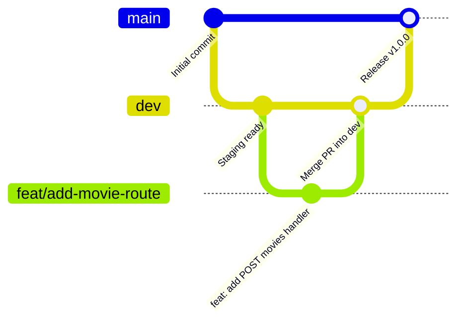

# Movie Recommendation API: Project Requirements & Team Backlog

This document outlines the requirements, workflow guidelines, and the comprehensive backlog of tasks for the **Group 7 Capstone Project**. 

> [!IMPORTANT]
> **Project Deadline**: June 4th
> **Tech Stack**: Node.js, Express.js
> **Database**: In-memory (array/JSON structure).
> **Objective**: Treat this project with a professional production mindset, focusing on collaboration, clean code, security, and rigorous testing.

---

## 1. Git Workflow & Repository Management

To support parallel development by a large team, we follow a strict branching model:

### Branch Definitions
* **`main`**: Holds stable, production-ready, fully tested code. Directly deployable.
* **`dev`**: The integration and staging branch where features are consolidated and verified.
* **Feature Branches (`feat/...`, `fix/...`)**: Individual workspace branches created by team members. Never commit directly to `dev` or `main`.

### Git Cheat Sheet for Team Members
| Action | Git Command |
| :--- | :--- |
| **Clone Repo** | `git clone <repo-url>` |
| **Create & Switch Branch** | `git checkout -b feat/<your-feature-name>` |
| **Stage Changes** | `git add <file-name>` or `git add .` |
| **Commit Changes** | `git commit -m "feat: <brief-description>"` (Use conventional commits) |
| **Push to Remote** | `git push origin feat/<your-feature-name>` |
| **Create Pull Request** | Done via the GitHub UI: Request merge from `feat/<your-branch>` into `dev`. |
| **Merge PR** | Leader reviews and approves merging `feat/<your-branch>` into `dev`. |

---

## 2. Comprehensive Task Backlog (50 Granular Tasks)

To coordinate collaboration, tasks have been categorized into five logical categories. Use these checklists to track task completion status.

### Category A: Infrastructure & Setup (Tasks 1-5)
- [✅] **01.** Initialize `package.json` and install production dependencies.
- [✅] **02.** Set up project folder structure (`/controllers`, `/routes`, `/models`, `/middleware`).
- [✅] **03.** Configure ESLint and Prettier for consistent code styling.
- [✅] **04.** Implement a centralized error-handling middleware.
- [✅] **05.** Create an initial custom logger middleware to log incoming HTTP requests.

### Category B: Data Modeling & Schema (Tasks 6-10)
- [✅] **06.** Define the initial movies array structure in `data.js`.
- [✅] **07.** Create a validation schema for the movie **Title** (non-empty string).
- [✅] **08.** Create a validation schema for the movie **Genre** (non-empty string).
- [✅] **09.** Create a validation schema for the movie **Release Year** (valid integer within bounds).
- [✅] **10.** Create a validation schema for the movie **Rating** (numeric decimal between 0.0 and 10.0).

### Category C: CRUD Implementation & Unit Testing (Tasks 11-30)

#### Create (POST)
- [ ] **11.** Implement the route handler for adding a new movie.
- [ ] **12.** Implement input sanitization for new movies.
- [ ] **13.** Add checks to prevent duplicate movie titles.
- [ ] **14.** Write a unit test for a successful POST operation.
- [ ] **15.** Write a unit test for a failed POST operation (due to missing/invalid fields).

#### Read (GET)
- [ ] **16.** Implement the endpoint to GET all movies.
- [ ] **17.** Implement the endpoint to GET a single movie by its ID.
- [ ] **18.** Implement query filtering by movie genre.
- [ ] **19.** Implement sorting logic (e.g., sorting by year or rating).
- [ ] **20.** Write unit tests for all GET endpoints (success and query-filtering cases).

#### Update (PUT/PATCH)
- [ ] **21.** Implement the PUT route handler to update the entire movie object.
- [ ] **22.** Implement the PATCH route handler to update just the rating of a movie.
- [ ] **23.** Implement a generic "ID not found" error handler for updates.
- [ ] **24.** Write a unit test for a successful update operation.
- [ ] **25.** Write a unit test for a failed update operation (invalid payload or ID not found).

#### Delete (DELETE)
- [ ] **26.** Implement the route handler to delete a movie by its ID.
- [ ] **27.** Add confirmation logic and error handling for deleting non-existent/invalid IDs.
- [ ] **28.** Write a unit test for a successful delete operation.
- [ ] **29.** Write a unit test for a failed delete operation (ID not found).
- [ ] **30.** Ensure data state persists correctly after deletion operations.

### Category D: Testing, Scripting & Documentation (Tasks 31-40)
- [ ] **31.** Write and export a Postman Collection folder for POST requests.
- [ ] **32.** Write and export a Postman Collection folder for GET requests.
- [ ] **33.** Write and export a Postman Collection folder for PUT/PATCH requests.
- [ ] **34.** Write and export a Postman Collection folder for DELETE requests.
- [ ] **35.** Create API endpoint documentation in `README.md`.
- [ ] **36.** Document local installation and start steps in `README.md`.
- [ ] **37.** Set up local environment config template (`.env.example`).
- [ ] **38.** Write a local environment setup simulation script.
- [ ] **39.** Ensure all code comments conform to JSDoc formatting standards.
- [ ] **40.** Perform final integration testing on all API routes.

### Category E: Presentation & Quality Assurance (Tasks 41-50)
- [ ] **41.** Create Slide 1: Introduction and Team Roles.
- [ ] **42.** Create Slide 2: API Architecture diagram.
- [ ] **43.** Create Slide 3: Endpoint walkthrough (including Postman screenshots).
- [ ] **44.** Create Slide 4: Challenges faced & applied solutions.
- [ ] **45.** Create Slide 5: Conclusion and future improvements.
- [ ] **46.** Draft a 5-minute presentation script.
- [ ] **47.** Record Part 1 of the Video Demo (installation, setup, linting).
- [ ] **48.** Record Part 2 of the Video Demo (API CRUD operations in action).
- [ ] **49.** Perform a final audit of the codebase for "clean, readable, and secure code."
- [ ] **50.** Complete the final repository check before the June 4th deadline.
